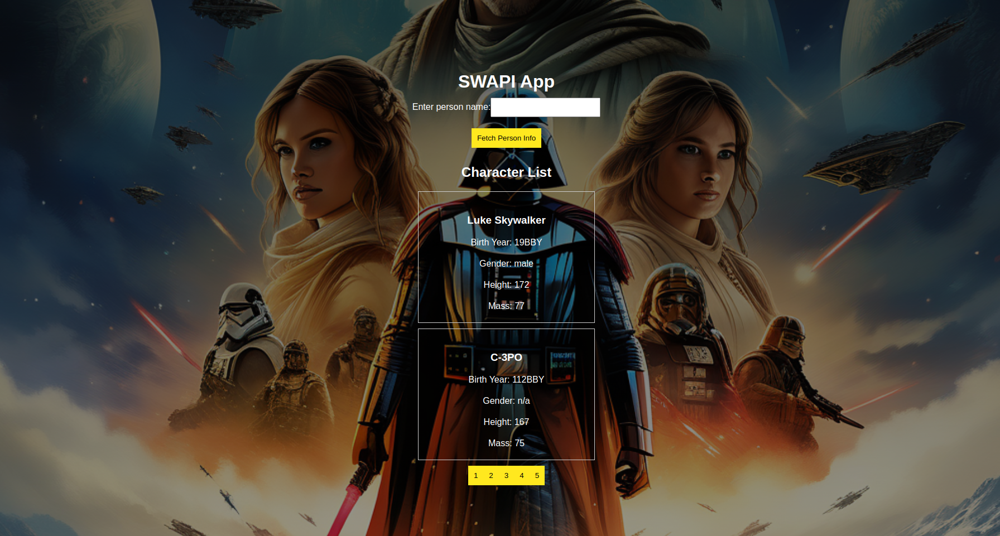

SWAPI App

Welcome to the SWAPI App! This web application allows you to explore information about Star Wars characters using the Star Wars API (SWAPI).
Features

    Search for a Character: Enter the name of a Star Wars character to fetch detailed information.

    View Character Information: Once you search for a character, you can view various details such as birth year, gender, planet, vehicles, and films they appeared in.

    Character List: Explore a paginated list of Star Wars characters. Two characters are displayed per page for easy navigation.

1. Getting Started

   Clone the repository to your local machine.

   git clone https://github.com/Xardy24/swapi-frontend.git

2. Navigate to the project directory.

   cd swapi-frontend

3. Install dependencies.

   npm install

4. Start the application.

   npm start

5. Open your browser and go to http://localhost:3000 to view the app.

## Dockerization

### Build Docker Image

Build the Docker image for your application:

    docker build -t swapi-frontend .
    docker run -p 3000:3000 swapi-frontend

Usage

    Enter the name of a Star Wars character in the provided input field.

    Click the "Fetch Person Info" button to retrieve information about the specified character.

    Explore the details of the character, including birth year, gender, planet, vehicles, and films.

    Navigate through the paginated list of Star Wars characters to discover more about each one.

Technologies Used

    React: A JavaScript library for building user interfaces.
    Axios: A promise-based HTTP client for making requests to APIs.
    SWAPI: The Star Wars API provides data about the Star Wars Universe.

Credits

    SWAPI: Star Wars API (SWAPI)

Feel free to explore the Star Wars universe with SWAPI App! May the Force be with you!



```

```
